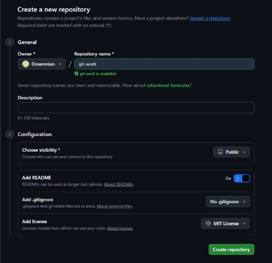
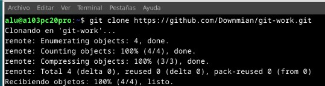
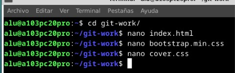
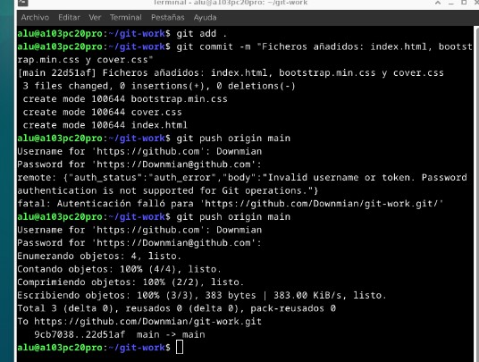

# TÍTULO DE LA PRÁCTICA

***Nombre:*** Damián Maneiro Lorenzo, Carla García Pacheco  
***Curso:*** 2º de Ciclo Superior de Desarrollo de Aplicaciones Web.

### ÍNDICE

+ [Introducción](#id1)
+ [Objetivos](#id2)
+ [Material empleado](#id3)
+ [Desarrollo](#id4)
+ [Conclusiones](#id5)

#### ***Introducción***. 

La siguiente práctica propuesta consta de una serie de pasos destinados a practicar y reforzar el uso del control de versiones con Git. Consiste en un total de 21 mini-tareas, en las que crearemos un repositorio en GitHub y llevaremos a cabo diversas actividades, como pull requests, issues, commits, entre otras.

#### ***Objetivos***. 

El objetivo de esta práctica, como se mencionó en el apartado anterior, es reforzar los conocimientos adquiridos en el curso anterior sobre el manejo de Git y GitHub. Para ello, las distintas mini-tareas abordarán el uso de ramas y los comandos básicos necesarios para hacer un buen uso de esta herramienta.

#### ***Material empleado***. 

Enumeramos el material empleado tanto hardware como software y las conficuraciones que hacemos (configuraciones de red por ejemplo) 

#### ***Desarrollo***. 

1. **El alumnado trabajará por parejas: user1 y user2. Indicar quién es user1 y quién es user2.**
    + user1: Damián
    + user2: Carla

1. **user1 creará un repositorio público llamado git-work en su cuenta de GitHub, añadiendo un README.md y una licencia MIT.**

Creamos el repositorio en GitHub añadiendo lo que se nos indica.
   

   
1. **user1 clonará el repo y añadirá los ficheros: index.html, bootstrap.min.css y cover.css. Luego subirá los cambios al upstream.**

Clonamos en repositorio en nuestra máquina.

Creamos los ficheros index.html, bootstrap.min.css y cover.css.

Añadimos los cambios que hemos hecho y los subimos al upstream.

   
1. **user2 creará un fork de git-work desde su cuenta de GitHub.**

Para crear un fork, se utiliza la herramienta que ofrece el propio GitHub. Esto generará una copia del repositorio original creado por el usuario 'user1'.

Después de hacer clic en 'Create fork', deberíamos tener un repositorio similar al siguiente.

1. **user2 clonará su fork del repo.**
1. **user1 creará una issue con el título "Add custom text for startup contents".**

Creamos una issue desde el apartado "Issues" en GitHub.

   
   
1. **user2 creará una nueva rama custom-text y modificará el fichero index.html personalizándolo para una supuesta startup**
1. **user2 enviará un PR a user1.**
1. **user1 probará el PR de user2 en su máquina (copia local) creando previamente un remoto denominado upstream, y realizará ciertos cambios en su copia local que luego deberá subir al propio PR.**
1. **user1 y user2 tendrán una pequeña conversación en la página del PR, donde cada usuario incluirá, al menos, un cambio más.**
1. **user1 finalmente aprobará el PR, cerrará la issue creada (usando una referencia a la misma) y actualizará la rama principal en su copia local.**
1. **user2 deberá incorporar los cambios de la rama principal de upstream en su propia rama principal.**
1. **user1 creará una issue con el título "Improve UX with cool colors".**
1. **user1 cambiará la línea 10 de cover.css a: color: purple;**
1. **user1 hará simplemente un commit local en main → NO HACER git push.**
1. **user2 creará una nueva rama cool-colors y cambiará la línea 10 de cover.css a: color: darkgreen;**
1. **user2 enviará un PR a user1.**
1. **user1 probará el PR de user2 (en su copia local). A continuación tratará de mergear el contenido de la rama cool-colors en su rama principal y tendrá que gestionar el conflicto: Dejar el contenido que viene de user2.**
1. **Después del commit para arreglar el conflicto, user1 modificará la línea 11 de cover.css a: text-shadow: 2px 2px 8px lightgreen;**
1. **user1 hará un commit especificando en el mensaje de commit el cambio hecho (sombra) y que se cierra la issue creada (usar referencia a la issue). A continuación subirá los cambios a origin/main.**
1. **user1 etiquetará esta versión (en su copia local) como 0.1.0 y después de subir los cambios creará una "release" en GitHub apuntando a esta etiqueta.**

> ***IMPORTANTE:*** si estamos capturando una terminal no hace falta capturar todo el escritorio y es importante que se vea el nombre de usuario.

Si encontramos dificultades a la hora de realizar algún paso debemos explicar esas dificultades, que pasos hemos seguido para resolverla y los resultados obtenidos.

#### ***Conclusiones***. 

En esta parte debemos exponer las conclusiones que sacamos del desarrollo de la prácica.
